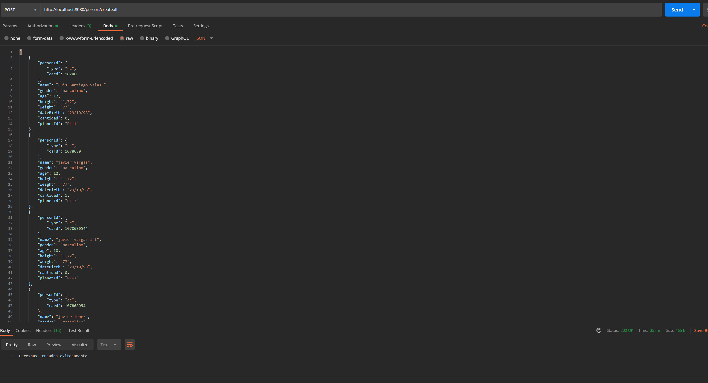

# FrontPlanets

This project was generated with Angular CLI version 10.0.4 and Java Spring Boot and has, for reasons of time the backend  was running at 70% but I didn't get a chance to finish the frontend and the unit test and also has implemented swagger

## Development server
Rirst run `mvn spring-boot:run ` for a dev server (demo), then use the postmna application to make the first posts of the application since the application uses a local database, for them you must use 2 url (http://localhost:8080/person/createall) and (http://localhost:8080/planet/createall) and the body of each respective url is in the data .xml file, then  
Run `ng serve` for a dev server (frontPlanets). Navigate to `http://localhost:4200/`. 

## Postman evidences 

## Autor

* **Javier Vargas** - 
